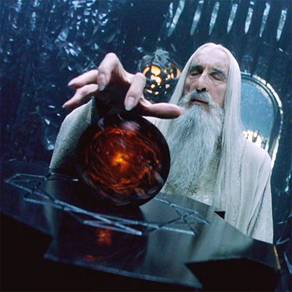

# the purpose of this project is to show how to convert images types/themes using [plotly](https://plotly.com/)

#### in this project I use plotly because it's cool, and I prefer it to [matplotlib](https://matplotlib.org/) because plotly is simpler, visualizations (both 3D and 2D + animations) are better looking, easier to use and requires less lines of code

#### the image I use in this project is Saruman from 'The Lord of the Rings' film trilogy, played by my favorite actor, Sir Cristopher Lee

####other cool things featured in this project:
##* original image: 
##* grayscaled image: 
##* gaussian blurred image: 
##* edged image: 
##* cartoon image: 
