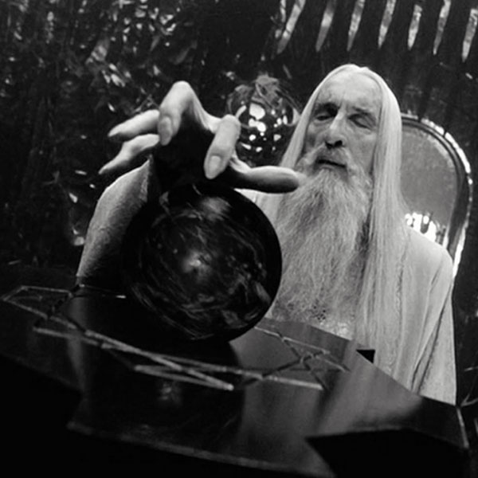
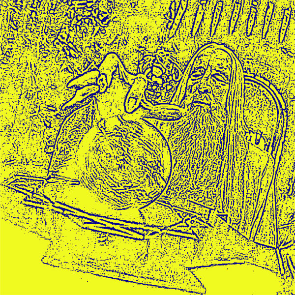
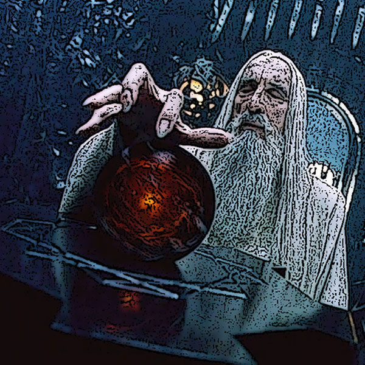

# the purpose of this project is to show how to convert images types/themes using [plotly](https://plotly.com/)

#### the image I use in this project is Saruman from 'The Lord of the Rings' film trilogy, played by my favorite actor, Sir Cristopher Lee

other cool things featured in this project:
* original image: 
* grayscaled image: 
* gaussian blurred image: 
* edged image: 
* cartoon image: 
